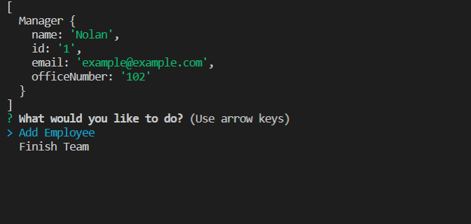
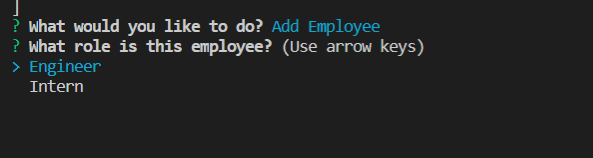
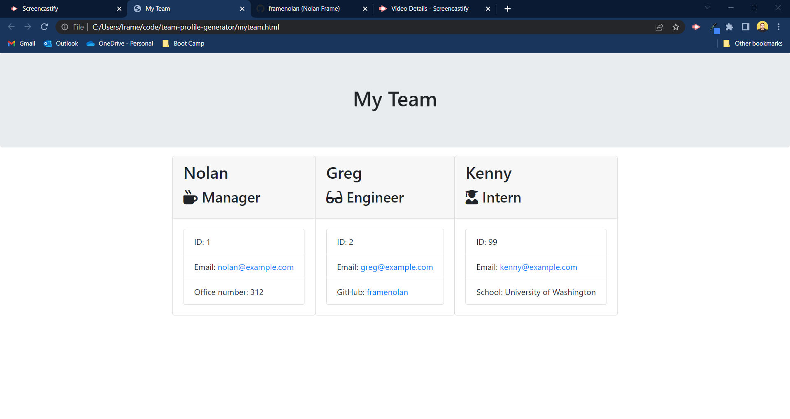

# Team Profile Generator

[](https://opensource.org/licenses/MIT)

## Deployed Site

[Deployed Site](https://framenolan.github.io/team-profile-generator)

## Table of Contents
* [Description](#description)
* [Installation](#installation)
* [Technologies](#technologies)
* [Usage](#usage)
* [Future Development](#future-development)
* [Credits](#credits)
* [Tests](#tests)
* [Questions](#questions)
* [License](#license)

## Description

This command line app takes user input to build an HTML page that includes basic information about members of a team. The app begins by asking for team Manager information, then provides the user a menu with options to add additional team members or to finalize the team and generate the HTML page. If the user chooses to add additional team members, then they are prompted to choose which role the new team member fills, either Engineer or Intern. Each option requests a different set of input. Once the input for each team member is complete, then the user is sent back to the menu to choose to add another team member or finalize the team.

## Installation

All used modules are included in the package.json. To install the necessary modules used in this app, run the following command in your terminal:

```md
npm install
```

## Technologies

- HTML
- CSS
- [Bootstrap CSS Framework](https://getbootstrap.com/)
- JavaScript
- Node.js

## Usage

Once installed, initialize the app by opening your command terminal and running the following code:

```md
node index.js
```

The app will prompt you to enter the team Manager information. Once complete, you'll be presented with a menu to either add another team member or finalize the team. If you choose to add another member, you'll be prompted to choose their role, either Engineer or Intern, and then prompted with an additional seried of questions. Once all team members are added, choose Finalize Team to print the HTML page. This page will be created in the root folder of the application and will be called 'myteam.html'.

Please reference the following video and screenshots for a walkthrough:

[Video Walkthrough](https://drive.google.com/file/d/14cCXosKywzB4o4oRk7p-BFxCAbACx1DG/view)







## Future Development

There are no plans for future development of this app.

## Credits

- Nolan Frame: [https://github.com/framenolan](https://github.com/framenolan)

## Tests

This app includes four test packages for the four object classes. To run these tests, enter the following command into the terminal:

```md
npm run test
```

The testing package used in this app is [Jest](https://www.npmjs.com/package/jest).

## Questions

Please visit [https://github.com/framenolan/](https://github.com/framenolan/) for additional contact.

## License

The MIT License (MIT)

Copyright (c) 2022 Nolan Frame

Permission is hereby granted, free of charge, to any person obtaining a copy of this software and associated documentation files (the "Software"), to deal in the Software without restriction, including without limitation the rights to use, copy, modify, merge, publish, distribute, sublicense, and/or sell copies of the Software, and to permit persons to whom the Software is furnished to do so, subject to the following conditions:

The above copyright notice and this permission notice shall be included in all copies or substantial portions of the Software.

THE SOFTWARE IS PROVIDED "AS IS", WITHOUT WARRANTY OF ANY KIND, EXPRESS OR IMPLIED, INCLUDING BUT NOT LIMITED TO THE WARRANTIES OF MERCHANTABILITY, FITNESS FOR A PARTICULAR PURPOSE AND NONINFRINGEMENT. IN NO EVENT SHALL THE AUTHORS OR COPYRIGHT HOLDERS BE LIABLE FOR ANY CLAIM, DAMAGES OR OTHER LIABILITY, WHETHER IN AN ACTION OF CONTRACT, TORT OR OTHERWISE, ARISING FROM, OUT OF OR IN CONNECTION WITH THE SOFTWARE OR THE USE OR OTHER DEALINGS IN THE SOFTWARE.